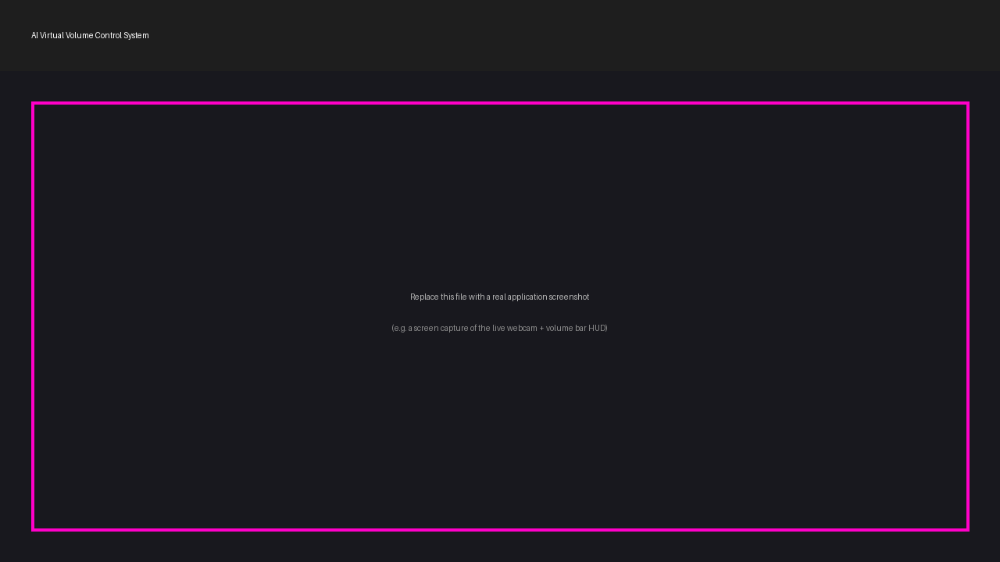

<div align="center">

# 🔊 AI Virtual Volume Control System

### Control your computer's system volume using only hand gestures, in real time — powered by Computer Vision and AI.


</div>

---

## 📌 Overview

**AI Virtual Volume Control System** is a real-time, vision-based application
that lets you control your computer's system volume purely through hand
gestures captured by a standard webcam. It uses **Google's MediaPipe Hands**
model to track 21 hand landmarks per frame, converts the distance between
your thumb and index fingertip into a target volume level through a custom
**gesture stabilization pipeline**, and applies that level to the operating
system's audio mixer via **Pycaw** (Windows Core Audio API bindings).

This project was built as a portfolio piece for an **AI & Machine Learning
diploma**, with an emphasis on clean architecture, modular design, and
production-style engineering practices rather than a quick single-file
script.

> 💡 Pinch your fingers together to lower the volume, spread them apart to
> raise it — all without touching a single key or slider.

---

## ✨ Features

| Feature | Description |
|---|---|
| 🖐️ **Real-time hand detection** | 21-point hand landmark detection via MediaPipe, running live from webcam input |
| 🎯 **Accurate landmark tracking** | Per-frame thumb and index fingertip localization used to drive the volume signal |
| 🔊 **Distance-based volume control** | Thumb-to-index fingertip distance is linearly mapped to a 0–100% volume level |
| 🪄 **Smooth volume transition** | Exponential Moving Average (EMA) filter on the target volume prevents abrupt jumps |
| 📉 **Gesture stabilization** | A rolling-average window smooths the raw fingertip distance before conversion, filtering out landmark jitter |
| 📊 **Dynamic volume bar** | Live, color-coded vertical bar that fills/empties in real time |
| 🔢 **Live volume percentage** | On-screen numeric readout of the current system volume |
| 🔇 **Mute / unmute gesture** | Hold a closed fist briefly to toggle mute, with debounce + cooldown to prevent accidental flapping |
| 📈 **Live FPS counter** | On-screen, smoothed real-time frame rate |
| 🎯 **Detection confidence display** | Live MediaPipe hand-detection confidence score |
| 📷 **Webcam status indicator** | Visual ONLINE/OFFLINE indicator with automatic recovery on frame-read failure |
| ⌨️ **Safe exit shortcut** | Press `Q` or `ESC` to shut down cleanly at any time |
| 🛡️ **Robust error handling** | Graceful handling of missing cameras, dropped frames, and unavailable audio endpoints |
| 🖥️ **Cross-platform runnable** | Automatically falls back to a simulation mode if Pycaw/Windows audio isn't available, so the full pipeline remains testable on any OS |
| ⚡ **Performance optimized** | Threshold-gated system calls avoid redundant OS-level volume updates every frame |

---

## 🛠️ Technology Stack

- **Python 3.12+**
- **[OpenCV](https://opencv.org/)** — video capture, image processing, on-screen UI rendering
- **[MediaPipe](https://developers.google.com/mediapipe)** — real-time hand landmark detection
- **[Pycaw](https://github.com/AndreMiras/pycaw)** — Python bindings for the Windows Core Audio API
- **[comtypes](https://github.com/enthought/comtypes)** — COM interop layer required by Pycaw
- **[NumPy](https://numpy.org/)** — numerical operations and coordinate math

---

## ⚙️ Installation Guide

### 1. Clone the repository

```bash
git clone https://github.com/abidcore/AI-Virtual-Volume-Control.git
cd AI-Virtual-Volume-Control
```

### 2. Create a virtual environment (recommended)

```bash
python -m venv venv

# Windows
venv\Scripts\activate

# macOS / Linux
source venv/bin/activate
```

### 3. Install dependencies

```bash
pip install -r requirements.txt
```

> ⚠️ **Note:** Real system-volume control (via Pycaw) requires **Windows**,
> since Pycaw wraps the Windows Core Audio API. On macOS/Linux the
> application still runs fully — hand tracking, the gesture pipeline, and
> the on-screen UI all work — but volume changes are simulated in memory
> rather than applied to the OS.

### 4. Run the application

```bash
python main.py
```

Press **`Q`** or **`ESC`** in the video window at any time to exit safely.

---

## 🎮 Usage Instructions

| Gesture | Action |
|---|---|
| 👍☝️ Thumb + index finger extended, other fingers curled | Volume control mode — move fingers apart to raise volume, together to lower it |
| ✊ Closed fist, held briefly (~0.5s) | Toggle mute / unmute |

All thresholds (distance range, smoothing factors, hold-frame counts,
cooldowns, etc.) can be tuned in **`config/settings.py`** without touching
any application logic.

---

## 📂 Folder Structure

```
AI-Virtual-Volume-Control/
│
├── main.py                    # Application entry point / main loop
├── requirements.txt           # Python dependencies
├── README.md                  # Project documentation (this file)
├── LICENSE                    # MIT License
├── .gitignore                 # Git ignore rules
│
├── assets/
│   ├── demo.png                # Screenshot placeholder
│   └── logo.png                # Project logo placeholder
│
├── config/
│   ├── __init__.py
│   └── settings.py             # Centralized, tunable configuration
│
├── src/
│   ├── __init__.py
│   ├── hand_tracker.py         # MediaPipe hand detection wrapper
│   ├── gesture_detector.py     # Gesture recognition & stabilization engine
│   ├── volume_controller.py    # Pycaw-based OS volume control + smoothing
│   ├── utils.py                # Geometry helpers & HUD/volume-bar drawing
│   └── fps.py                  # FPS counter utility
│
└── docs/
    └── project_report.md       # Detailed technical project report
```

---

## 🔄 Project Workflow

```
Webcam Frame
     │
     ▼
HandTracker (MediaPipe)   ──►  21 hand landmarks per frame
     │
     ▼
GestureDetector            ──►  Finger-state classification, distance
                                 stabilization (rolling average),
                                 debounced VOLUME_CONTROL / MUTE_TOGGLE
     │
     ▼
VolumeController            ──►  Distance → percentage mapping, EMA
                                 smoothing, Pycaw system call (or
                                 simulated fallback)
     │
     ▼
Operating System Audio Mixer
```

---

## 🖼️ Screenshots

> Replace the placeholder image below with an actual screen capture of the
> application running (webcam feed + hand landmarks + volume bar HUD).

<div align="center">
  
</div>

---

## ✅ Advantages

- Fully touch-free, hardware-free volume control using only a standard webcam
- Real-time responsiveness with sub-frame-level smoothing for a polished feel
- Robust against accidental gestures through dual-layer debouncing (mode
  confirmation + action cooldowns)
- Cleanly separated, independently testable modules (tracking, gesture
  logic, and OS control are fully decoupled)
- Runs and is fully demonstrable on any OS, even where real audio control
  is unavailable, thanks to the simulation fallback

---

## 🚀 Future Improvements

- 🧠 Replace geometric gesture rules with a trained lightweight gesture classifier for greater robustness
- 🎚️ Add a settings GUI (PyQt/Tkinter) for live calibration instead of editing config files
- 🖥️ Cross-platform native audio backends (CoreAudio for macOS, PulseAudio/ALSA for Linux) to remove the Windows-only limitation
- ✋ Two-hand gestures for independent volume + mute control
- 📈 Session analytics: gesture accuracy and usage logging
- 🧪 Automated unit tests with `pytest` and a CI pipeline via GitHub Actions
- 📦 Packaging as a standalone executable (PyInstaller) for non-technical users
- ♿ Accessibility-focused calibration mode for users with limited hand mobility

---

## 📋 Requirements

- Python 3.12+
- A working webcam
- Windows OS (for real system-volume control via Pycaw; other platforms run in simulation mode)
- See `requirements.txt` for exact package versions

---

## 📄 License

This project is licensed under the **MIT License** — see the [LICENSE](LICENSE) file for details.

---

## 👤 Author

**Abid Ali**
AI & Machine Learning Diploma Student

- GitHub: [@abidcore](https://github.com/abidcore)
- LinkedIn: [Abid Ali Shaikh](https://www.linkedin.com/in/abid-ali-shaikh-03a591423)
- Email: abidalishaikh2007@gmail.com

---

<div align="center">

⭐ If you found this project useful, consider giving it a star on GitHub!

</div>
